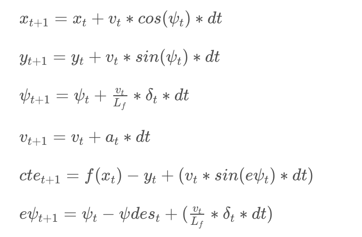

# CarND-Controls-MPC
Self-Driving Car Engineer Nanodegree Program

---

## Description

* The model
  * The vehicle model used is a kinematic model
  * Details can be found in the lecture and equations below
  * 

* N & dt
  * Bigger T=N dt gives smoother controls but less responsive
  * Smaller T=N dt gives better responsive control but less smooth
  * Given T, bigger dt value needs more computational power
  * I started with N = 25 , dt = 0.05 which is from the quizz solution from the lecture. It gave me a pretty good result.
  * Then I small tuned the dt to 0.08 to make the car drive more stable.
* Polynomial Fitting and MPC Preprocessing
  * I started with a linear model then realised that a third order polynomial worked better in turns.
  * State is converted to local vehicle point before passing to MPC model
* Model Predictive Control with Latency
  * As suggested in SDCND slack channel, firstly I predict the future state using the latency which is 0.1 sec then pass the future state to MPC model.
